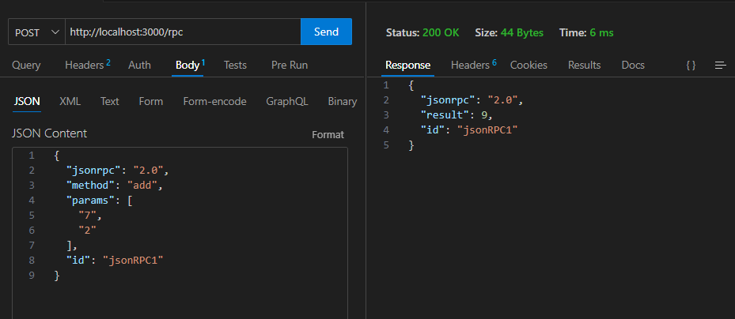

# JSON RPC
    JSON-RPC is a remote procedure call (RPC) protocol encoded in JSON. It allows for communication between a client and server by invoking methods on the server, passing parameters, and receiving results. It is transport agnostic, meaning it can be used over different transport protocols such as HTTP, WebSocket, or TCP.

## Key Features:
    1) Requests and Responses: The communication is done by sending a "request" with the necessary parameters to call a method, and receiving a "response" with the result or error message.

    2) Lightweight: Since it is based on JSON (JavaScript Object Notation), it is lightweight, easy to parse, and language-independent.

    3) Versioning: JSON-RPC includes a version field to support different versions of the protocol.

## Structure:
### Request Object:
    jsonrpc: Specifies the version of the JSON-RPC protocol (e.g., "2.0").
    method: The name of the method to be invoked.
    params: An array or object containing the parameters for the method (optional).
    id: A unique identifier to match the request with the response.

### Response Object:
    jsonrpc: The version of the protocol (usually "2.0").
    result: The result of the method call (if successful).
    error: An error object if something went wrong.
    id: The same id that was provided in the request.

