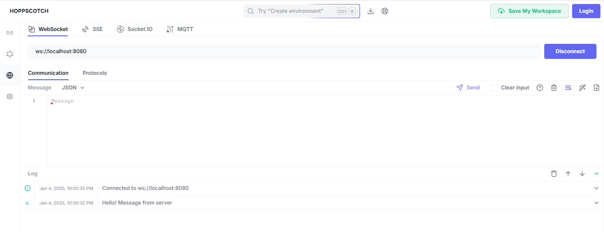

# learn-websockets using nodejs and reactjs.

## Command to start websocket server
    npm run start 

## Command to start client
    npm run dev

## For testing the websocket server use website hoppscotch
    Enter the websocket url ws://localhost:8080 and hit connect to establish

